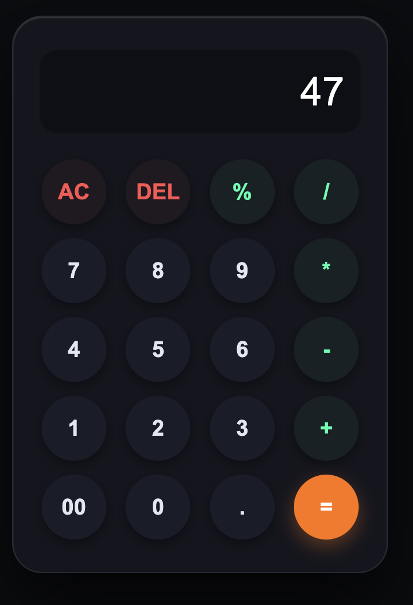

# 📱 Glassmorphic Calculator

A modern calculator built with HTML, CSS, and JavaScript featuring a glassmorphism-inspired user interface and responsive design.

🚀 **Live Demo:** https://saranshgupta-dev.github.io/glassmorphic-calculator/

---

## 🎨 Preview



---

## ✨ Features

* Glassmorphism UI with frosted glass effects
* Responsive design for desktop and mobile devices
* Basic arithmetic operations (+, −, ×, ÷)
* Decimal number support
* Input validation to prevent invalid operator sequences
* Smooth hover and button interaction effects

---

## 🛠️ Tech Stack

* HTML5
* CSS3
* JavaScript (ES6)

---

## 📂 Project Structure

glassmorphic-calculator/

├── index.html

├── style.css

├── script.js

└── screenshot.png

---

## 🚀 Getting Started

1. Clone the repository

```bash
git clone https://github.com/saranshgupta-dev/glassmorphic-calculator.git
```

2. Open `index.html` in your browser

---

## 📄 License

This project is open source and available under the MIT License.
